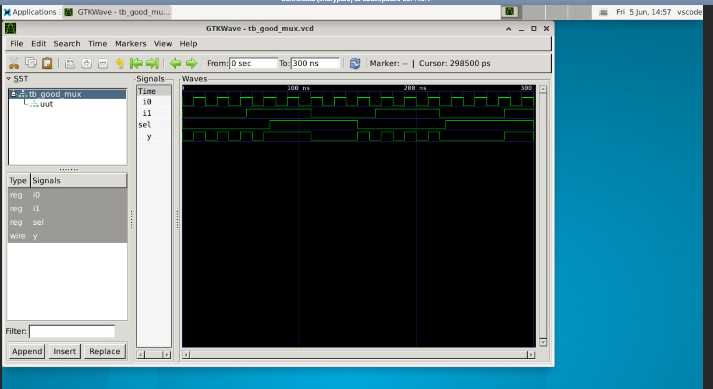
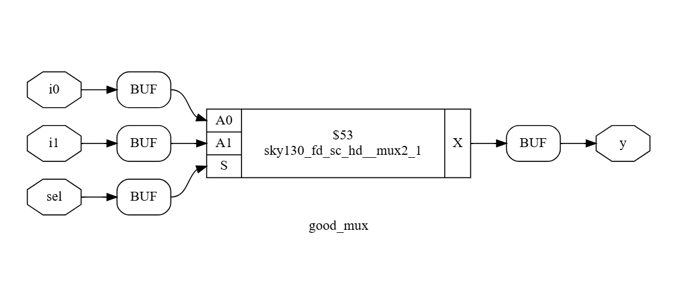

# Day 1: RTL Design, Functional Simulation, and Logic Synthesis Flow

This folder documents my hands-on laboratory exercises for Day 1 of the workshop. The work covers verifying behavioral multiplexer designs using Icarus Verilog and performing logic synthesis with Yosys targeted at the SkyWater 130nm PDK.

---

## 📁 Section Directory
1. [Simulation Core Concepts](#1-simulation-core-concepts)
2. [RTL Verification Pipeline](#2-rtl-verification-pipeline)
3. [Lab Experiment: 2-to-1 Multiplexer Verification](#3-lab-experiment-2-to-1-multiplexer-verification)
4. [HDL Source Code Analysis](#4-hdl-source-code-analysis)
5. [Logic Synthesis Fundamentals & Library Architecture](#5-logic-synthesis-fundamentals--library-architecture)
6. [Lab Experiment: Yosys Synthesis Execution](#6-lab-experiment-yosys-synthesis-execution)
7. [Day 1 Summary](#7-day-1-summary)

---

## 1. Simulation Core Concepts

### What is a Simulator?
A simulator is an Electronic Design Automation (EDA) software tool used to check if a digital circuit functions correctly before it is committed to physical manufacturing.

*   **Our Simulator Tool:** Icarus Verilog (`iverilog`)

### Core Elements of the Test Environment
*   **Design Module:** The functional Verilog RTL code containing the actual digital logic. It contains explicit primary input and output ports.
*   **Testbench Block:** A wrapper architecture used to test the design block. A testbench **contains no primary input or output ports**. It sets up a localized verification loop using two main blocks:
    *   **Stimulus Generator:** Generates changing test patterns and feeds them directly into the inputs of the design under test.
    *   **Stimulus Observer:** Continuously reads, logs, and checks the resulting outputs against expected values.


## 2. RTL Verification Pipeline


*   The `iverilog` tool compiles the design module and testbench concurrently.
*   Executing the compiled simulator binary outputs a value changes dump (`.vcd`) log tracking signal activity.
*   The `.vcd` trace data is loaded into `GTKWave` for timeline-based signal evaluation.

---

## 3. Lab Experiment: 2-to-1 Multiplexer Verification

### Interactive Command Log
```bash
# Navigate to the target workshop lab project repository
cd sky130RTLDesignAndSynthesisWorkshop/verilog_files

# Compile the behavioral hardware model alongside its validation testbench
iverilog good_mux.v tb_good_mux.v

# Execute the generated simulation code to dump active waveform events
./a.out

# Open the visual waveform viewer tool to check signal logic paths
gtkwave tb_good_mux.vcd
```

### Captured Functional Waves
Below is the verification trace showing functional matching across inputs and selection lines:



---

## 4. HDL Source Code Analysis

The functional behavioral design implementation for the target 2-to-1 multiplexer circuit (`good_mux.v`):

```verilog
module good_mux (input i0 , input i1 , input sel , output reg y);
always @ (*)
begin
	if(sel)
		y <= i1;
	else 
		y <= i0;
end
endmodule
```

### Functional Logic Walkthrough
*   The module defines three structural inputs (`i0`, `i1`, `sel`) and a single output (`y`) declared as a register type to support procedural assignments.
*   The procedural block uses an always sensitivity list (`@ (*)`) that triggers whenever any input signal state changes.
*   A conditional evaluation control statement determines output routing: when the selection control line `sel` evaluates to a logic-high state (1), input channel `i1` guides the output target `y`. When `sel` registers a logic-low state (0), the routing swaps, driving channel `i0` directly to output `y`.

---

## 5. Logic Synthesis Fundamentals & Library Architecture

### What is a Logic Synthesizer?
A logic synthesizer (such as `Yosys`) is an automation engine that processes high-level behavioral code descriptions (RTL) and restructures them into a functionally identical technology-mapped gate-level netlist.

```text
    [ Verilog RTL Code ] --------> read_verilog ───+

                                                   |
                                                   v
                                            +--------------+
                                            | Yosys Engine | ===> [ Structural Netlist ]
                                            +--------------+
                                                   ^
                                                   |
    [ Target PDK (.lib) ] -------> read_liberty ───+
```

*   **`read_verilog`**: Parses design behavior specifications into basic logical representations.
*   **`read_liberty`**: Imports structural specifications, pin constraints, and behavioral capabilities of foundry primitives.
*   **`write_verilog`**: Exports the final validated structural gate schematic network configuration.

### Cell Libraries and Primitives (`.lib`)
A target cell library is a collection of standard logical primitives (AND, NAND, MUX, Flops) provided by the semiconductor foundry. A single logic cell type contains multiple structural variants, or **"flavors"**, designed to balance tradeoffs across chip implementation constraints.

#### Why Do We Need Varied Gate Flavors?
*   **Fast Gate Flavors:** Engineered with wider transistor configurations to provide high electrical drive capability. This enables rapid voltage state switching, which speeds up signal paths. However, they demand a larger physical layout footprint and exhibit high dynamic power consumption.
*   **Slow Gate Flavors:** Engineered with smaller, narrower transistor shapes. They display slower operational transition profiles but minimize physical silicon consumption and draw far less leakage power.

#### Application Scenarios
*   **Critical Timing Paths:** If a specific logic pathway takes too long to calculate, causing the signal to arrive late (violating setup constraints), the synthesizer substitutes **Fast Gate Flavors** along that path to prevent clock speed failures.
*   **Non-Critical Paths:** If a signal settles at its target destination well ahead of the next active clock edge, using high-power fast gates is unnecessary. The engine optimizes power and area layout efficiency by swapping in **Slow Gate Flavors**.

### Gate-Level Synthesis Verification
Because the structural netlist maintains identical primary input and output interfaces as the original RTL code, you can reuse the **exact same testbench** to verify post-synthesis accuracy. Simulating the netlist inside `iverilog` should yield matching waves in `GTKWave`.

---

## 6. Lab Experiment: Yosys Synthesis Execution

### Interactive Command Sequence
Inside the terminal environment, the design is loaded, optimized, and mapped to the target foundry cell library:

```bash
yosys
read_liberty -lib ../lib/sky130_fd_sc_hd__tt_025C_1v80.lib
read_verilog good_mux.v
synth -top good_mux
abc -liberty ../lib/sky130_fd_sc_hd__tt_025C_1v80.lib
write_verilog -noattr good_mux_netlist.v
show -format svg -prefix ./mux_schematic
```

---

## 📊 Synthesis Output Analysis & Metrics

### 1. Pre-Mapping Statistics (Section 3.26)
Before technology cell mapping, Yosys identifies the overall module requirements from the processed hardware description logic:
*   **Number of Wires:** 4
*   **Number of Public Wires:** 4
*   **Number of Cells:** 1 generic multi-port multiplexer asset (`$_MUX_`)

### 2. Technology Mapping Results (Section 4.1.2)
After executing the `abc` technology pass, the generic multiplexer is successfully transformed into a real, physically-manufacturable cell from the SkyWater 130nm library:
*   **Target Standard Cell Used:** `sky130_fd_sc_hd__mux2_1` (Quantity: 1)
*   **Internal Signals:** 0
*   **Input Signals:** 3
*   **Output Signals:** 1

### Generated Netlist Schematic Graph
Below is the synthesized circuit schematic generated via the `show` command, verifying a clean technology mapping with zero dangling wires or latch errors:



---

## 7. Day 1 Summary
*   **Functional Verification:** Confirmed the logical design correctness of a 2-to-1 Multiplexer module (`good_mux.v`) using an `iverilog` simulation testbench environment and verified the runtime behavior timeline via `GTKWave`.
*   **Logic Synthesis Flow:** Successfully utilized `Yosys` to process behavioral RTL code and technology-map it down into structural primitives.
*   **Hardware Realization:** Verified that the generic compiler structure was successfully mapped to a high-density, low-power standard hardware cell (`sky130_fd_sc_hd__mux2_1`) inside the **SkyWater 130nm Open-Source PDK**.

