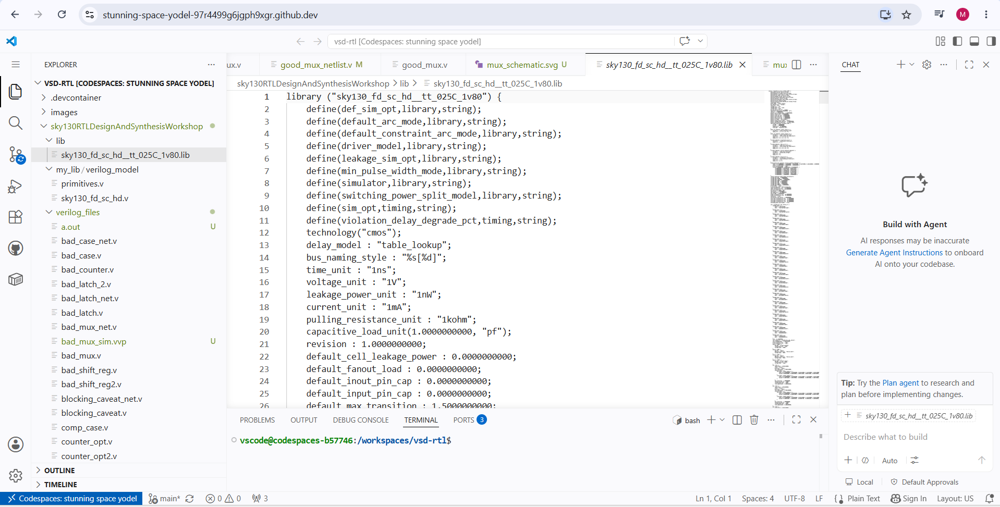
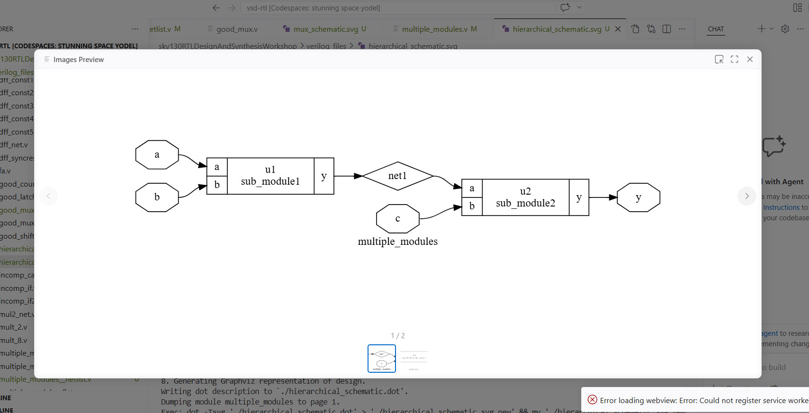
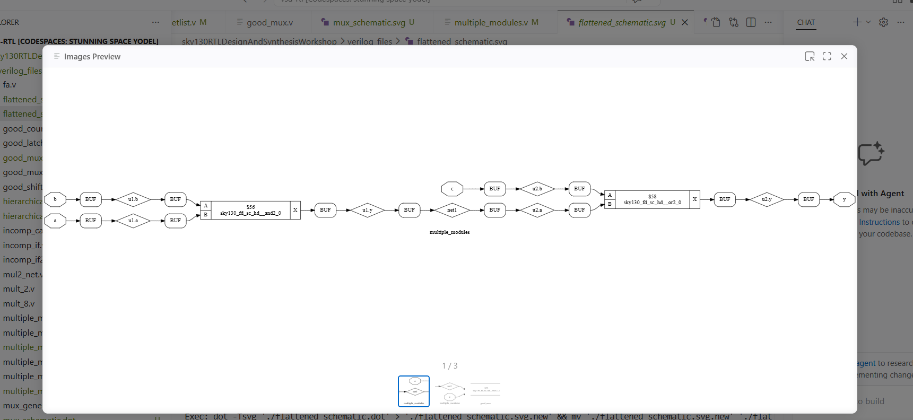
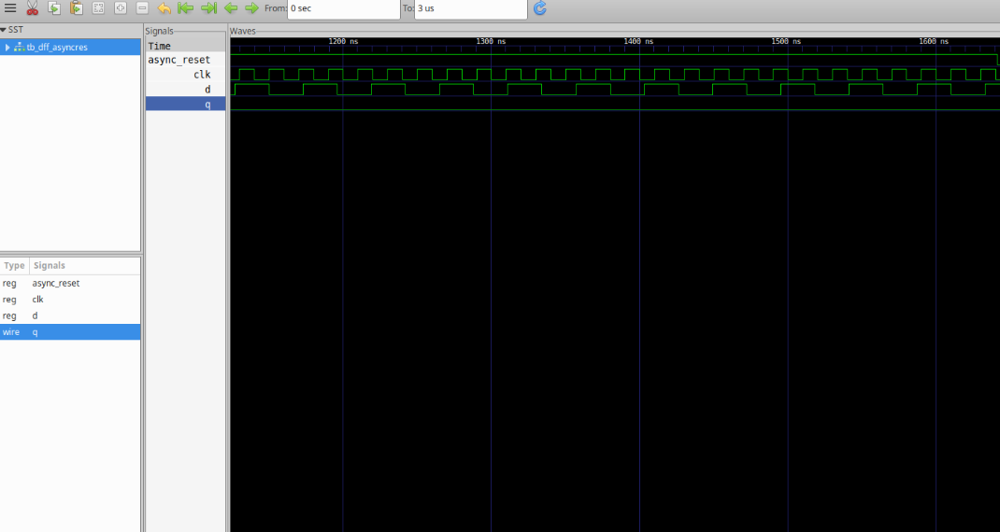
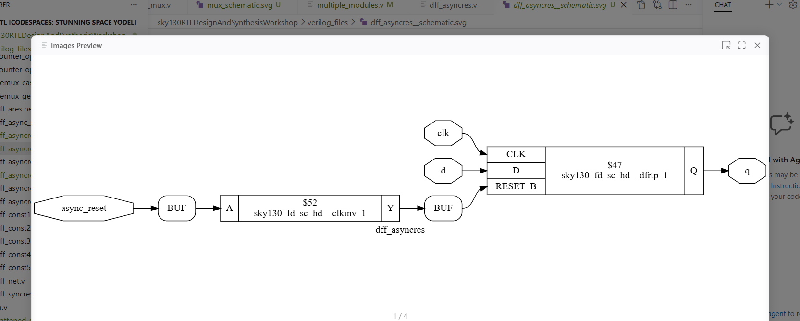

# Day 2: Timing Libraries, Synthesis Approaches, and Efficient Flip-Flop Coding

This folder contains my laboratory records and design notes for Day 2. The curriculum covers the architectural exploration of Liberty `.lib` files, a comparative study between hierarchical and flattened synthesis approaches, and functional simulation of edge-triggered storage devices using asynchronous/synchronous reset configurations.

---

## 📁 Section Directory
1. [Timing Libraries & SKY130 PDK](#1-timing-libraries--sky130-pdk)
2. [Hierarchical vs. Flattened Synthesis](#2-hierarchical-vs-flattened-synthesis)
3. [Flip-Flop Coding Styles](#3-flip-flop-coding-styles)
4. [Simulation & Synthesis Verification Workflow](#4-simulation--synthesis-verification-workflow)
5. [Day 2 Summary](#5-day-2-summary)

---

## 1. Timing Libraries & SKY130 PDK

### PDK Technical Foundation
The **SkyWater 130nm Open-Source PDK** delivers foundational process models and standard cell primitives optimized for physical IC implementation. The timing behavior of these standard cells is captured inside standard cell timing model databases.

### Decoding `sky130_fd_sc_hd__tt_025C_1v80.lib`
The library name describes the strict operational environmental conditions under which the cell behaviors are modeled:
*   **`tt` (Typical-Typical):** Represents the nominal manufacturing process corner where both NMOS and PMOS transistors operate with standard speed profiles.
*   **`025C` (25°C):** Specifies the standard ambient thermal operating temperature.
*   **`1v80` (1.8V):** Indicates the core nominal power supply rail voltage.

### Inside the Timing Library Database
Opening and inspecting the foundational parameters reveals global parameters that establish electrical constraints across the entire logic network:



#### Crucial Parameters:
*   **Global Measurement Scale:** Time is baseline quantified in `1ns`, voltage values translate to `1V`, and active dynamic/static leakage power indexes match `1nW` bounds.
*   **Lookup Table Templates:** Structural definitions (like `constraint_3_0_1` or `power_inputs_1`) format multi-dimensional grids used to interpolate cell propagation delay and transition metrics based on two runtime variables: `input_transition_time` and `total_output_net_capacitance`.

---

## 2. Hierarchical vs. Flattened Synthesis

### Hierarchical Synthesis
*   **Definition:** Maintains the modular design sub-hierarchies exactly as defined in the high-level behavioral Verilog code. Sub-modules are processed and synthesized separately as discrete logic blocks.
*   **Advantages:** Dramatically reduces tool runtime compilation loads across large designs; significantly simplifies debugging paths since internal instance names trace back directly to RTL structural definitions.
*   **Disadvantages:** Limits the synthesis tool's capability to apply optimization logic boundaries across module wire connections.

#### Hierarchical Logic Mapping Example:
The generated graph schematic below demonstrates separate boundary groupings for `u1` (`sub_module1`) and `u2` (`sub_module2`) under a parent wrapper cell:



---

### Flattened Synthesis
*   **Definition:** Collapses all internal sub-module boundaries, merging all functional logic units into a single structural netlist network layer from the ground up.
*   **Advantages:** Allows the synthesis tool to perform aggressive logic gate reduction and optimization across inter-module paths, yielding a tighter physical footprint and better timing metrics.
*   **Disadvantages:** Increases memory overhead and compilation execution paths on massive hardware scales; complicates post-synthesis gate trace-back debugging loops.

#### Flattened Logic Mapping Example:
Executing the `flatten` instruction strips sub-module outlines, creating a unified gate-level implementation layer:



---

### Comparative Evaluation Matrix


| Technical Aspect | Hierarchical Synthesis Approach | Flattened Synthesis Approach |
| :--- | :--- | :--- |
| **Design Hierarchy** | Preserved modular groupings | Entirely collapsed |
| **Optimization Scope** | Restricted to individual module walls | Whole-design boundary optimization |
| **Tool Execution Speed** | Faster on massive designs | Slower on large-scale circuits |
| **Debugging Complexity** | Easier (clear mapping to original RTL) | Complex (flattened netlist wire networks) |
| **Output Profile** | Clean modular cell blocks | Unified, dense netlist layout |
| **Primary Use Case** | Large system assembly & reporting | Maximum performance and area tuning |

---

## 3. Flip-Flop Coding Styles

Flip-flops are fundamental memory storage assets used to isolate combinational logic clouds and control synchronous clock boundaries. Adding clear hardware controls (Reset/Set) guarantees predictable logic states at initialization.

### A. Asynchronous Reset D Flip-Flop
The reset control loop functions outside clock boundaries. When triggered, the output resets to low immediately, regardless of current clock conditions.

```verilog
module dff_asyncres (input clk, input async_reset, input d, output reg q);
  always @ (posedge clk, posedge async_reset)
    if (async_reset)
      q <= 1'b0;
    else
      q <= d;
endmodule
```

### B. Asynchronous Set D Flip-Flop
Similar to the async reset, this control line overrides clock edges instantly but forces the internal storage register to a logic-high state ($1$) instead.

```verilog
module dff_async_set (input clk, input async_set, input d, output reg q);
  always @ (posedge clk, posedge async_set)
    if (async_set)
      q <= 1'b1;
    else
      q <= d;
endmodule
```

### C. Synchronous Reset D Flip-Flop
The reset control is bounded inside the clock loop. The output state evaluates reset criteria only at the exact moment the active clock edge occurs.

```verilog
module dff_syncres (input clk, input sync_reset, input d, output reg q);
  always @ (posedge clk)
    if (sync_reset)
      q <= 1'b0;
    else
      q <= d;
endmodule
```

---

## 4. Simulation & Synthesis Verification Workflow

### Functional RTL Simulation Pipeline
Using `iverilog`, the design implementation code is validated against testbench constraints to output an active waveform database:

```bash
# Compile behavioral model alongside verification testbench block
iverilog dff_asyncres.v tb_dff_asyncres.v

# Run simulation executable to output structural value dumps
./a.out

# Load generated data maps into visual analyzer tool
gtkwave tb_dff_asyncres.vcd
```

### Simulation Trace Verification Output
The visual timeline log below shows the asynchronous control signal instantly overriding the active clock edge to drive the target output low:



---

### Technology-Mapped Netlist Synthesis
Below is the sequence of structural constraints and transformation commands used inside the interactive Yosys tool console to complete hardware mapping:

```bash
# Launch the Yosys synthesis interactive shell environment
yosys

# Read and import the targeted cell technology liberty definitions
read_liberty -lib ../lib/sky130_fd_sc_hd__tt_025C_1v80.lib

# Parse high-level behavioral code architectures
read_verilog dff_asyncres.v

# Execute logic compiler optimization focusing on the top-level block module
synth -top dff_asyncres

# Explicitly map the flip-flop cells to the liberty library architectures
dfflibmap -liberty ../lib/sky130_fd_sc_hd__tt_025C_1v80.lib

# Bind the remaining logic structures to target standard cells
abc -liberty ../lib/sky130_fd_sc_hd__tt_025C_1v80.lib

# Render the compiled structural gate-level netlist schematic
show
```

### Synthesized Gate Schematic Analysis
The technology-mapped structural netlist generated by the toolchain visually explains how behavioral RTL code converts to actual foundry cells:



#### Architectural Breakdown:
*   **Target Storage Primitive:** Yosys mapped our behavioral design to the physical cell primitive `sky130_fd_sc_hd__dfrtp_1` (a hardware D Flip-Flop featuring an active-low reset option pin labeled `RESET_B`).
*   **Inverter Insertion:** Since the Verilog code models an active-high `async_reset` loop while the structural foundry cell uses an active-low input line, Yosys automatically inserts a standard clock inverter cell (`sky130_fd_sc_hd__clkinv_1`) into the path. This hardware inversion ensures functional equivalence without human intervention.

---

## 5. Day 2 Summary
*   **Library Parsing:** Analyzed standard cell attributes, measurement scales, and lookup table interpolation matrices inside target `.lib` databases.
*   **Structural Optimization:** Evaluated tradeoffs between Hierarchical synthesis (faster, easier to debug) and Flattened synthesis (maximum cross-module path reduction).
*   **Sequential Logic Design:** Validated the behavioral differences between asynchronous resets (instant, edge-independent control) and synchronous resets (clock-edge restricted control) through functional simulation and netlist synthesis mapping.
