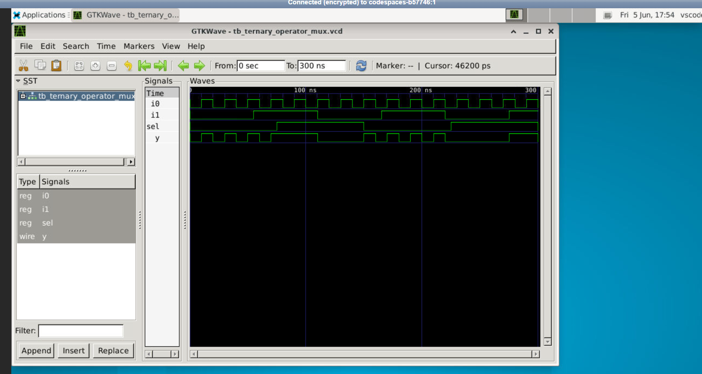
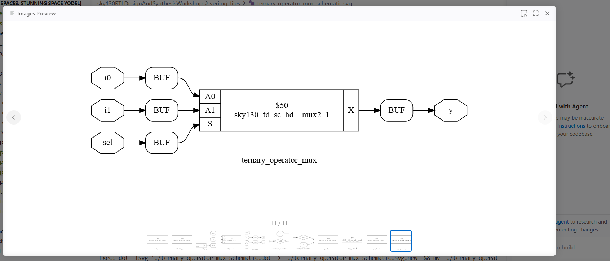
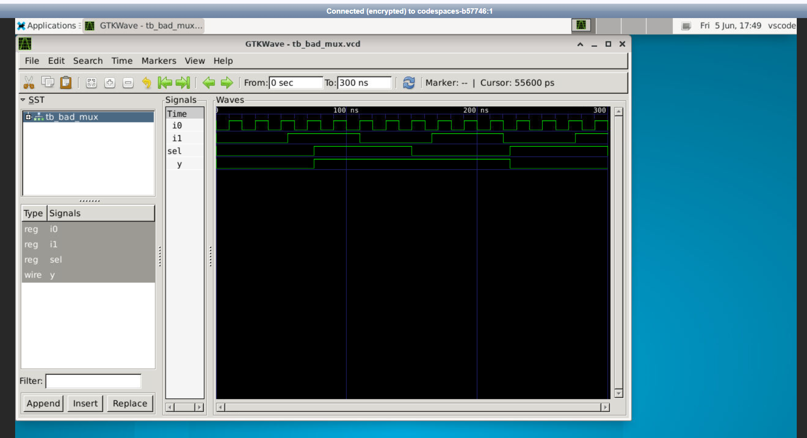
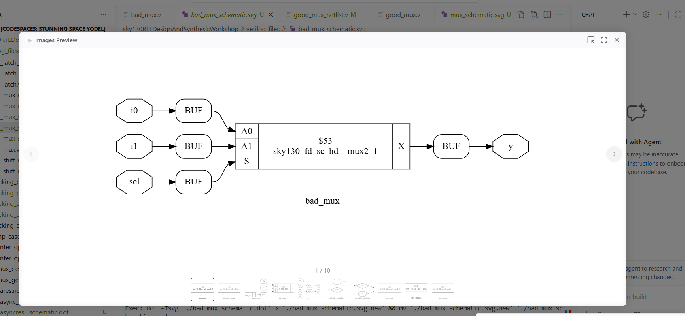
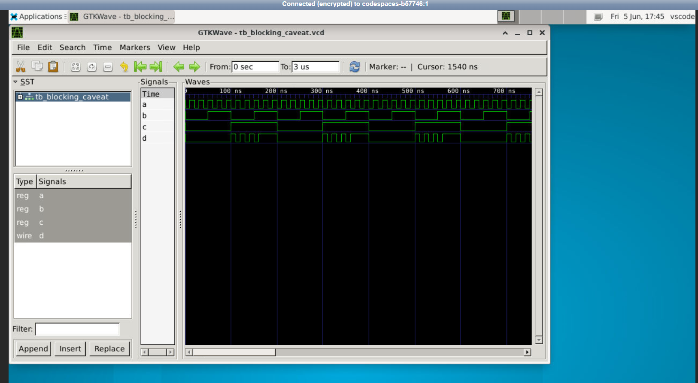
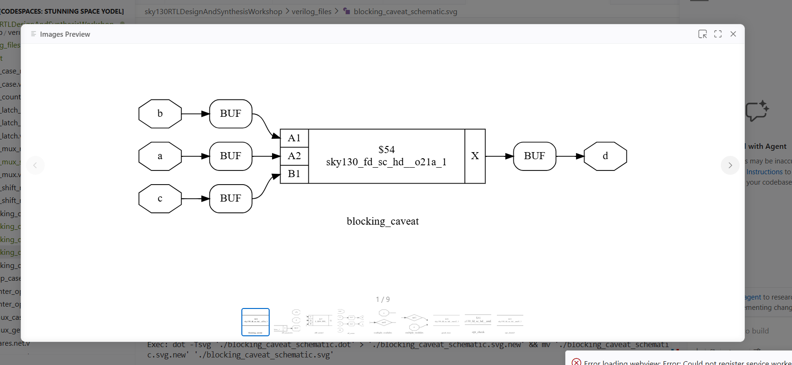

# Day 4: Gate-Level Simulation (GLS) and Synthesis-Simulation Mismatches

This folder documents my hands-on laboratory exercises and structural research notes for Day 4 of the workshop. The focus is on Gate-Level Simulation (GLS) methodologies, identifying functional mismatches between front-end RTL and synthesized gates, and examining blocking vs. non-blocking procedural assignments.

---

## 📁 Section Directory
1. [Core Architectural Concepts](#1-core-architectural-concepts)
2. [Procedural Assignment Rules](#2-procedural-assignment-rules)
3. [RTL Verification & Synthesis Labs](#3-rtl-verification--synthesis-labs)
4. [Day 4 Summary](#4-day-4-summary)

---

## 1. Core Architectural Concepts

### Gate-Level Simulation (GLS)
GLS is a vital verification phase where the post-synthesis structural netlist is simulated using the original functional testbench. 
*   **Functional Parity Check:** Confirms that the synthesis tool faithfully translated behavioral code loops into physical logic cell configurations.
*   **Timing Verification:** Evaluates real-world gate delays (using Standard Delay Format `.sdf` mapping) to identify clock setup or hold failures.

### Synthesis-Simulation Mismatch
A mismatch happens when the pre-synthesis RTL simulation matches testbench criteria, but the post-synthesis gate-level simulation or actual physical hardware behaves differently. Common causes include:
*   **Incomplete Sensitivity Lists:** Missing critical inputs inside procedural always blocks.
*   **Improper Assignment Rules:** Mixing combinational and sequential coding structures inside the same logical block.

---

## 2. Procedural Assignment Rules


| Assignment Type | Blocking Assignment (`=`) | Non-Blocking Assignment (`<=`) |
| :--- | :--- | :--- |
| **Operator Syntax** | `=` | `<=` |
| **Execution Path** | Immediate, sequential statement execution | Scheduled evaluation, concurrent assignment |
| **Update Timeline** | Updates variables instantly in line order | Updates target variables at the end of the time step |
| **Target Logic Type** | Combinational networks (`always @(*)`) | Sequential register tracking (`always @(posedge clk)`) |
| **Hardware Inferred** | Combinational logic gates | Memory storage flip-flops |

---

## 3. RTL Verification & Synthesis Labs

### 🔬 Lab 1: Functional Ternary Multiplexer (`ternary_operator_mux`)
This module implements a standard 2-to-1 Multiplexer using clean, continuous assignments with the ternary conditional operator.

#### Source Verilog Logic
```verilog
module ternary_operator_mux (input i0, input i1, input sel, output y);
  assign y = sel ? i1 : i0;
endmodule
```

#### Waveform Verification Trace
Continuous assignments map directly to combinational wire loops. The simulation output shows instant, glitch-free tracking matching the selection control lines:



#### Synthesized Gate Netlist
Because the RTL code is completely clear and unambiguous, Yosys synthesizes a perfect physical cell layout without latch creation:



*   **PDK Target Cell:** `sky130_fd_sc_hd__mux2_1` (Foundry 2-to-1 Multiplexer gate primitive).

---

### 🔬 Lab 2: Sensitivity List & Mismatch Vulnerability (`bad_mux`)
This experiment analyzes how an incomplete procedural sensitivity list can pass basic functional checks but create severe hardware bugs post-synthesis.

#### Defective Source Verilog Logic
```verilog
module bad_mux (input i0, input i1, input sel, output reg y);
  always @ (sel) begin
    if (sel)
      y <= i1;
    else 
      y <= i0;
  end
endmodule
```

#### Critical Coding Bugs Identified:
1.  **Incomplete Sensitivity List:** The always block is only sensitive to changes on the `sel` control line. If input `i0` or `i1` transitions while `sel` remains fixed, the simulator ignores the change. This forces an unintended memory latch behavior during pre-synthesis verification.
2.  **Improper Non-Blocking Operator:** Uses the non-blocking operator (`<=`) inside a combinational evaluation block.

#### Simulation Waveform Output
The simulation capture displays the resulting timing stall loops, where output changes fail to track active input pins because of the missing sensitivity fields:



#### Synthesized Optimization Netlist
When Yosys synthesizes this block, it overrides the broken simulation behavior by assuming an all-inclusive combinational logic target (`@(*)`), outputting a standard gate configuration:



*   **The Mismatch Catch:** The pre-synthesis RTL simulation holds old values (acting like a latch), but the post-synthesis netlist simulates as a pure combinational gate. This creates a dangerous **Synthesis-Simulation Mismatch** where your code and your hardware don't behave the same way.

---

### 🔬 Lab 3: Procedural Blocking Order Caveat (`blocking_caveat`)
This lab checks execution ordering defects when intermediate variables are calculated in an incorrect sequence inside combinational structures.

#### Defective Source Verilog Logic
```verilog
module blocking_caveat (input a, input b, input c, output reg d);
  reg x;
  always @ (*) begin
    d = x & c;  // Evaluated BEFORE x updates!
    x = a | b;  // New value of x is calculated too late.
  end
endmodule
```

#### Architectural Race Condition:
Because blocking assignments execute instantly in line order, variable `d` evaluates using the **old or uninitialized value** of intermediate register `x` from the previous simulation cycle. The newly computed value `x = a | b` is written too late to affect `d` in the current timestep.

#### Waveform Simulation Trace
The functional timeline displays data lagging by a full simulation execution cycle because of the inverted coding lines:



#### Synthesized Netlist Architecture
To maintain exact functional equivalence with your written order, the synthesis tool is forced to insert physical register loops or feedback lines to hold the old state of `x`:



*   **Corrected Best Practice Configuration:** To achieve pure combinational logic with no feedback loops, intermediate steps must always be ordered before they are read:
    ```verilog
    always @ (*) begin
      x = a | b; // 1. Calculate intermediate step first
      d = x & c; // 2. Compute final output safely
    end
    ```

---

## 4. Day 4 Summary
*   **Gate-Level Simulation Integration:** Used GLS methods to compile and run synthesized netlists against matching testbenches to verify logical equivalence.
*   **Sensitivity Mismatches:** Proved through `bad_mux` that omitting input variables from your always block sensitivity list creates severe functional mismatches between simulation code and real gates.
*   **Blocking Order Dependencies:** Proved through `blocking_caveat` that out-of-order blocking assignments (`=`) cause simulators to read stale data, forcing the synthesis engine to infer unintended feedback loops. Always code intermediate variables before utilizing them.
