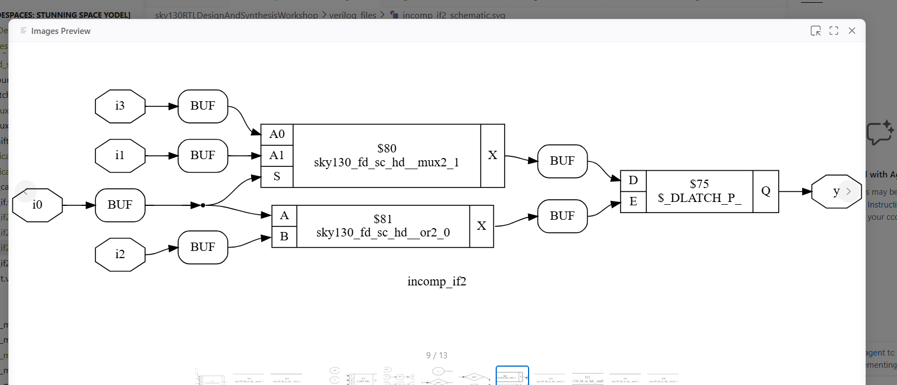
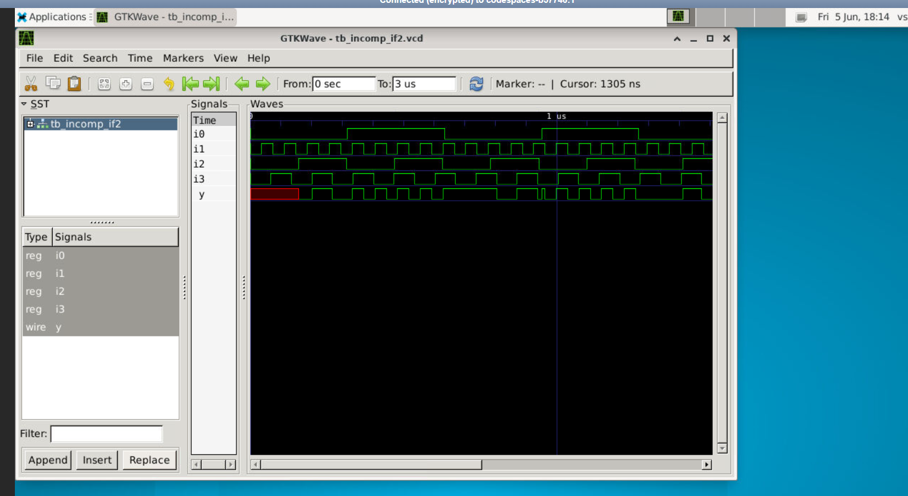
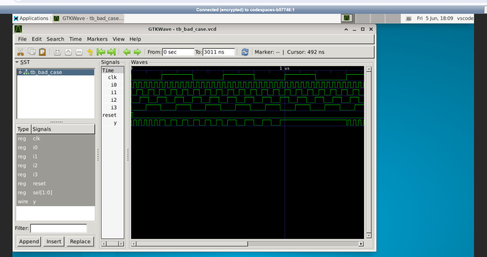
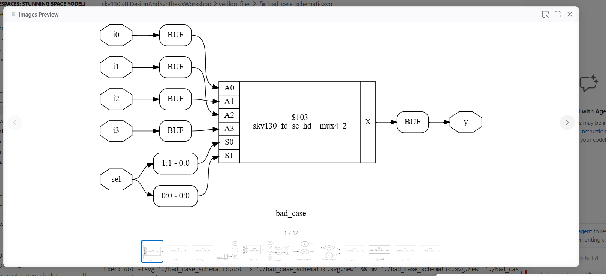
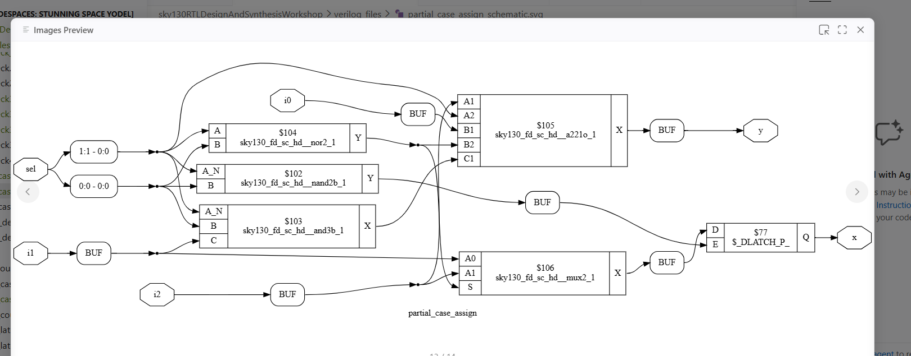

# Day 5: Optimization in Synthesis and Advanced Structural Construct Tracking

This folder documents my hands-on laboratory exercises and architectural notes for Day 5 of the workshop. The work covers conditional hardware priority routing using `if-else` and `case` constructs, analyzing the electrical causes behind unintended hardware latch inference, and scaling complex designs using iterative `for` loops and structural `generate` blocks.

---

## 📁 Section Directory
1. [Conditional Control Primitives](#1-conditional-control-primitives)
2. [Inferred Hardware Latches](#2-inferred-hardware-latches)
3. [Iterative Loops & Structural Generate Blocks](#3-iterative-loops--structural-generate-blocks)
4. [Advanced Synthesis Optimization Labs](#4-advanced-synthesis-optimization-labs)
5. [Day 5 Summary](#5-day-5-summary)

---

## 1. Conditional Control Primitives

### Behavioral Priority Routing (`if-else`)
In hardware description languages, an `if-else` chain models a cascading multiplexer network where the first evaluated branch holds strict priority over subsequent execution branches.
*   **Multiplexer Cascading:** Each successive `else if` branch introduces an extra multiplexer layer, adding gate delay to the signal path.
*   **Proper Evaluation:** Designers must place timing-critical signals at the very top of the hierarchy to bypass these cascading routing delays.

---

## 2. Inferred Hardware Latches

An **Inferred Latch** is a severe structural design defect that occurs when a variable inside a combinational procedural block (`always @(*)`) is not explicitly assigned a value across all possible execution paths.

```text
       [ Combinational Always Block ]

                     |
         [ Is Input Condition True? ]
             /                \
          (Yes)               (No)
           /                    \
  [ Update Output ]     [ Output Not Defined! ]
                                 |
                        v----------------v

                        | Inferred Latch | ---> (Holds previous state)
                        v----------------v
```

### The Mechanism of Latch Generation
Digital logic cells cannot floatingly lose their value. If your code tells the circuit to update an output when a selector line is high, but fails to define what that output should do when the selector line drops low, the synthesis engine assumes the circuit must **hold its previous state**. To satisfy this requirement, the compiler inserts an transparent hardware D-latch primitive.

### Practical Hardware Disadvantages
1.  **Timing Analysis Breakdowns:** Latches are transparent while the control line is active, which complicates Static Timing Analysis (STA) loops and introduces severe clock skew hazards.
2.  **Glitch Vulnerability:** Spurious hazards or electrical noise on selection lines can ripple directly to the output ports, causing functional failures.

---

## 3. Iterative Loops & Structural Generate Blocks

### Behavioral `for` Loops
*   **The Concept:** Used inside procedural blocks to automate the description of uniform, repetitive combinational operations.
*   **The Mechanism:** A `for` loop does not represent a physical state machine looping over time in hardware. Instead, the synthesis engine completely unrolls the loop expressions at compilation time, stamping out a series of identical parallel hardware gate tracks.

### Structural `generate` Macros
*   **The Concept:** Bounded within `generate` / `endgenerate` walls, these blocks allow conditional or repetitive instantiation of hardware modules, wires, or primitive assets.
*   **The Mechanism:** Evaluated during structural elaboration before synthesis occurs. This allows designers to easily scale parameter-driven designs (such as expanding a Ripple Carry Adder from 4 bits to 64 bits) by dynamically stamping out physical hardware module walls.

---

## 4. Advanced Synthesis Optimization Labs

### 🔬 Lab 1: Missing Branch Conditions (`incomp_if2`)
This lab checks synthesis results when multiple conditions are nested within an `if` expression chain but the final fallback path remains completely undefined.

#### Source Verilog Logic
```verilog
module incomp_if2 (input a, input b, input c, input d, output reg y);
  always @(*) begin
    if (a) y = b;
    else if (c) y = d;
    // Critical Defect: Missing final 'else' fallback!
  end
endmodule
```

#### Simulation Timeline Capture
Because the evaluation tracks are not completely defined, the output terminal holds its old logic values whenever inputs `a` and `c` evaluate to zero simultaneously, creating a memory state loop:



#### Synthesized Technology Netlist
Yosys detects this incomplete combinational path and automatically bridges the gap by inferring a transparent hardware latch cell to handle the hold state:



*   **PDK Target Cell:** `sky130_fd_sc_hd__dlxtp_1` (Foundry Transparent Latch block primitive).

---

### 🔬 Lab 2: Non-Exhaustive Conditional Switching (`bad_case`)
This laboratory examines structural output results when matching logic selectors inside a procedural `case` statement overlap or fail to outline a universal default condition.

#### Source Verilog Logic
```verilog
module bad_case (input [1:0] sel, input i0, input i1, output reg y);
  always @(*) begin
    case (sel)
      2'b00: y = i0;
      2'b01: y = i1;
      // Critical Defect: Branches 2'b10 and 2'b11 are unmapped with no default fallback!
    endcase
  end
endmodule
```

#### Waveform Simulation Trace
The signal timeline below shows data transitions stalling and freezing because the circuit hits unmapped state combinations:



#### Synthesized Technology Netlist
Because binary combinations `10` and `11` are unmapped, Yosys inserts a latch mechanism to protect the unspecified hold conditions, creating an inefficient circuit layout:



---

### 🔬 Lab 3: Partial Variable Multi-Assignment (`partial_case_assign`)
This experiment explores what happens when a `case` block maps all incoming branch selectors successfully, but fails to define an assignment value for every internal output target variable within those paths.

#### Source Verilog Logic
```verilog
module partial_case_assign (input [1:0] sel, input i0, input i1, output reg y, output reg z);
  always @(*) begin
    case (sel)
      2'b00: begin y = i0; z = i1; end
      2'b01: begin y = i1; end // Critical Defect: Variable 'z' is not assigned here!
      default: begin y = 1'b0; z = 1'b0; end
    endcase
  end
endmodule
```

#### Synthesized Technology Netlist
Even though the `default` fallback is present, variable `z` is left completely unassigned whenever input combination `01` executes. This partial coverage forces the design compiler to insert an isolated transparent latch solely along the `z` data pathway:



*   **Optimization Takeaway:** To maintain pure, clean combinational hardware logic with zero inferred latches, every target output variable must be assigned a value in **every single branch** of an `if-else` or `case` block.

---

## 5. Day 5 Summary
*   **Priority Evaluation Routing:** Confirmed that `if-else` structures synthesize into cascading multiplexer arrangements that add gate delays along deep paths.
*   **Latch Invalidation Tracking:** Proved through `incomp_if2`, `bad_case`, and `partial_case_assign` that missing fallback paths or skipped assignments force the compiler to inject unintended transparent latch primitives (`dlxtp_1`).
*   **Array Scaling Loops:** Studied how `for` loop unrolling transforms procedural arrays into parallel hardware arrays at synthesis time, while `generate` blocks dynamically scale module layouts during structural elaboration.
