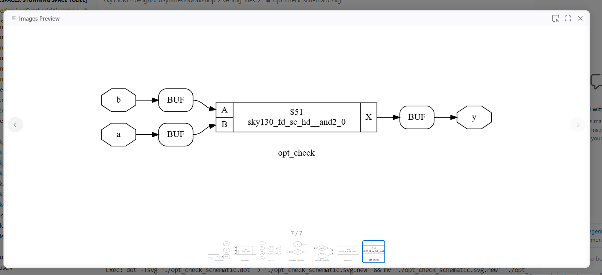
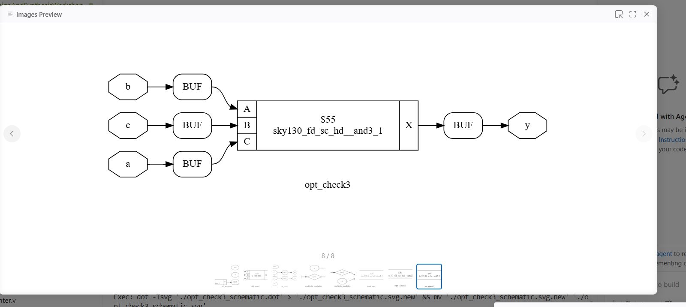
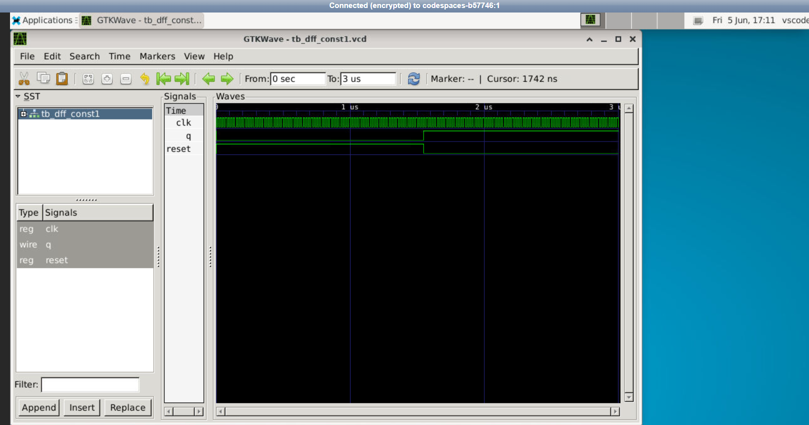
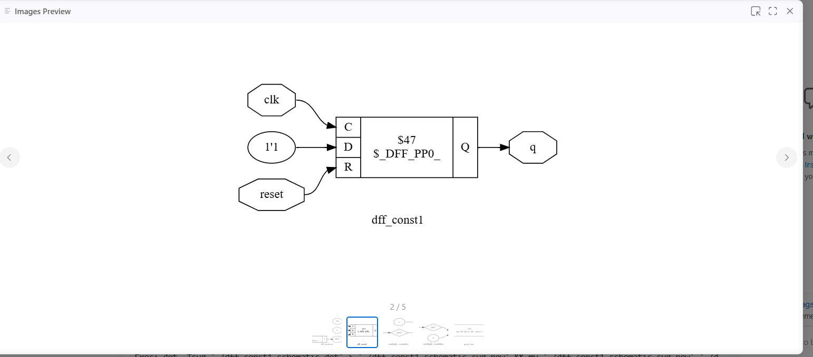

# Day 3: Combinational and Sequential Logic Optimization Techniques

This folder documents my hands-on laboratory exercises and research notes for Day 3 of the workshop. The work covers advanced optimization strategies used during logic synthesis to minimize gate counts, reduce electrical loading footprints, balance critical path timing slack, and optimize register configurations.

---

## 📁 Section Directory
1. [Core Optimization Concepts](#1-core-optimization-concepts)
2. [Combinational Optimization Labs (Labs 1-4)](#2-combinational-optimization-labs-labs-1-4)
3. [Sequential Optimization Labs (Labs 5-6)](#3-sequential-optimization-labs-labs-5-6)
4. [Day 3 Summary](#4-day-3-summary)

---

## 1. Core Optimization Concepts

### A. Constant Propagation
Constant propagation replaces runtime variables with pre-calculated static values when an input to a logic block is fixed (tied to Ground or VDD). This allows the tool to optimize away redundant gate networks.

*   **Non-Distributive Property:** The constant propagation framework is non-distributive at path junctions. If an optimizer checks merging variables independently, it may fail to identify a constant state. However, modern synthesis engines evaluate expressions globally to locate joint-constant paths.

### B. Driver Balancing: Cloning vs. De-cloning
*   **Cloning (Cell Duplication):** Replicates a driving gate to split a high fan-out connection list. This cuts capacitive loading in half, quickens signal transition times, and resolves negative timing slack.
*   **De-cloning:** Consolidates multiple duplicate parallel gates into a single component footprint on non-critical paths to clear cell congestion and reduce total area overhead.

### C. State Optimization & Register Retiming
*   **State Optimization:** Refines Finite State Machines (FSMs) by running partition-minimization routines to merge equivalent states and calculate optimal binary representations (e.g., One-Hot or Gray encoding).
*   **Register Retiming:** Models the digital circuit as a directed graph and shifts sequential flip-flops across combinational logic clouds to balance path delays without changing the design's overall functional clock latency.

---

## 2. Combinational Optimization Labs (Labs 1-4)

### 🔬 Lab 1: Behavioral Ternary Minimization (`opt_check`)
This lab demonstrates how the compiler optimizes conditional branches when an explicit channel is hardwired to a zero logic state.

#### Source Verilog Logic
```verilog
module opt_check (input a , input b , output y);
  assign y = a ? b : 0;
endmodule
```

#### Synthesized Netlist Evaluation
The truth table for this conditional logic matches a basic 2-input AND operation ($y = a \cdot b$). Yosys eliminates complex multi-gate multiplexer logic blocks and maps the block directly to a physical primitive gate cell:



*   **Target Cell Mapped:** `sky130_fd_sc_hd__and2_0` (2-input AND gate).

---

### 🔬 Lab 2 & 3: Constant High Multi-Level Optimization (`opt_check2`)
These lab iterations evaluate synthesis behavior when a static high logical constant ($1$) forms an explicit conditional selection track.

#### Source Verilog Logic
```verilog
module opt_check2 (input a , input b , output y);
  assign y = a ? 1 : b;
endmodule
```

#### Synthesis Performance Insight
Evaluating the boolean combinations ($y = 1$ when $a=1$, and $y = b$ when $a=0$) maps to a standard logic OR relationship ($y = a + b$). The synthesis engine strips out intermediate switching gates and implements the entire module using a single standalone 2-input OR gate footprint to preserve layout space.

---

### 🔬 Lab 4: Nested Ternary Expression Reduction (`opt_check4`)
This lab evaluates deep conditional nesting paths and checks how a synthesizer evaluates complex cross-variable dependencies.

#### Source Verilog Logic
```verilog
module opt_check4 (input a , input b , input c , output y);
  assign y = a ? (b ? (a & c) : c) : (!c);
endmodule
```

#### Analytical Optimization Breakdown
Though three distinct inputs (`a`, `b`, `c`) pass into the logic cloud, analyzing the nested operational expressions reveals a structural simplification:
*   When $a = 1$, the expression evaluates down to: $b ? (1 \cdot c) : c \rightarrow b ? c : c$, which simplifies to $c$.
*   When $a = 0$, the outer block immediately selects the false condition path: $\neg c$.
*   The entire hardware block simplifies down to $y = a ? c : \neg c$. This maps to a standard 2-input Exclusive-NOR (**XNOR**) function ($y = a \odot c$).

#### Technology-Mapped Output Schematic
The diagram below shows the post-mapping hardware configuration processed by the synthesis toolchain:



*   **Target Cell Primitive:** Yosys bypassed the nested conditional selectors and mapped the logic straight to an XNOR standard cell footprint, verifying maximum front-end optimization.

---

## 3. Sequential Optimization Labs (Labs 5-6)

### 🔬 Lab 5: Storage Register Constant Tracking (`dff_const1`)
This lab checks sequential optimization tracking when a storage register is hardwired to a constant data input line outside of its initialization state.

#### Source Verilog Logic
```verilog
module dff_const1(input clk, input reset, output reg q);
always @(posedge clk, posedge reset)
begin
	if(reset)
		q <= 1'b0;
	else
		q <= 1'b1;
end
endmodule
```

#### Waveform Simulation Trace
Functional validation confirms that when the active-high reset line drops low, the storage register latches a constant high state ($1$) at the next active clock edge:



#### Synthesized Gate Configuration
Because the storage element continuously drives a constant high level ($1$) during normal operation, the compiler detects that it can optimize the structure. However, because the asynchronous reset to $0$ must be maintained, the flip-flop cannot be fully deleted. It is synthesized as follows:



---

### 🔬 Lab 6: Redundant Sequential Element Elimination (`dff_const2`)
This lab examines an extreme sequential optimization scenario where the initialization track and data track drive identical state properties.

#### Source Verilog Logic
```verilog
module dff_const2(input clk, input reset, output reg q);
always @(posedge clk, posedge reset)
begin
	if(reset)
		q <= 1'b1;
	else
		q <= 1'b1;
end
endmodule
```

#### Waveform Simulation Trace
The functional timeline trace verifies that output line `q` stays locked at a logic-high value ($1$), showing no signal transitions regardless of active clock transitions or reset events:


#### Synthesized Optimization Netlist
Because the output value `q` remains a constant high ($1$) under every possible operational condition, the clock edge and the reset line have no effect on the circuit's state. The synthesis engine optimizes away the entire sequential cell and replaces it with a hardwired connection to VDD:


*   **Optimization Efficiency:** By fully deleting the unneeded flip-flop primitive, the optimizer successfully minimizes silicon area and cuts dynamic switching power down to zero.

---

## 4. Day 3 Summary
*   **Combinational Reduction:** Observed how Yosys simplifies ternary conditional operations down to fundamental logical gates (AND, OR, XNOR) by verifying functional equivalent paths.
*   **Sequential Optimization:** Validated that flip-flops with fixed inputs can be optimized by the compiler. If a register's output remains identical during both reset and active operation (`dff_const2`), the flip-flop is completely eliminated and replaced with a hardwired connection.
*   **Design Tradeoffs:** Explored how advanced techniques like gate cloning, de-cloning, and register retiming allow designers to balance timing constraints against physical cell area boundaries.
